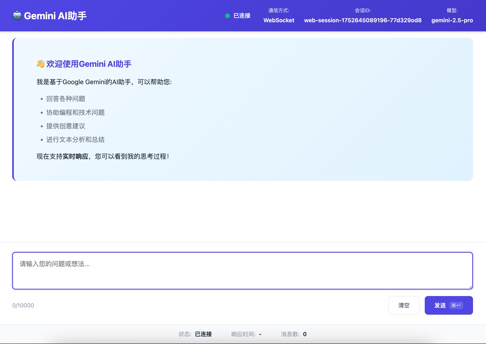

# 🌟 Gemini Web Simple

> 基于 Gemini AI 的简洁网页聊天应用，开箱即用的前后端一体化解决方案

[](LICENSE)
[](https://nodejs.org/)
[](https://expressjs.com/)


## ✨ 项目概述

Gemini Web Simple 是一个轻量级的网页聊天应用，让用户可以通过浏览器直接与 Google Gemini AI 进行对话。项目采用简洁的架构设计，专注于核心功能的实现。

### 🎯 核心特性

- 🚀 **开箱即用** - 一行命令启动完整应用
- 💬 **智能对话** - 集成最新的 Gemini 2.0 Flash 模型
- 📱 **响应式设计** - 完美适配桌面和移动设备
- 🛡️ **安全可靠** - 内置安全中间件和错误处理
- ⚡ **性能优化** - 轻量级架构，快速响应
- 🎨 **现代界面** - 简洁美观的用户体验

## 🏗️ 项目架构

```
packages/web-simple/
├── 📁 public/                  # 前端静态文件
│   ├── 🌐 index.html          # 主页面
│   ├── 🎨 style.css           # 样式文件  
│   └── ⚡ script.js           # 交互逻辑
├── 📁 server/                  # 后端服务器
│   ├── 🚀 app.js              # Express 应用
│   ├── 📦 package.json        # 依赖配置
│   ├── 🔧 start.sh            # 启动脚本
│   └── 📖 README.md           # 服务器文档
└── 📖 README.md               # 项目说明
```

### 🔧 技术栈

**前端:**
- HTML5 + CSS3 + 原生 JavaScript
- Fetch API 用于异步通信
- CSS Grid 和 Flexbox 布局
- 响应式设计

**后端:**
- Node.js 18+ 运行环境
- Express.js Web 框架
- Gemini CLI Core 集成
- Helmet + CORS 安全中间件

## 🚀 快速开始

### 1️⃣ 环境准备

确保您的系统已安装：
- [Node.js](https://nodejs.org/) 20.0.0 或更高版本
- npm 包管理器

### 2️⃣ 获取 API 密钥

1. 访问 [Google AI Studio](https://makersuite.google.com/app/apikey)
2. 创建新的 API 密钥
3. 复制密钥备用

### 3️⃣ 安装和配置

```bash
# 进入项目
# 安装gemini-cli 项目依赖
npm install

# 构建gemini-cli 项目
npm run build

# 进入服务器目录
cd packages/web-simple/server

# 安装依赖
npm install

# 创建环境变量文件
cp .env.example .env

# 设置环境变量
GEMINI_API_KEY="your_gemini_api_key_here"
```

### 4️⃣ 启动应用

```bash

# 或直接运行
npm start

# 开发模式（文件监听）
npm run dev
```

### 5️⃣ 访问应用

🎉 启动成功后，在浏览器中访问：**http://localhost:3000**

## 💻 使用指南

### 基本操作

1. **发送消息**: 在输入框中输入文本，点击发送或按 `Ctrl/Cmd + Enter`
2. **取消请求**: 处理中可点击"取消"按钮中止当前请求
3. **查看历史**: 所有对话记录会自动保存在当前会话中

### 快捷键

| 快捷键 | 功能 |
|--------|------|
| `Ctrl/Cmd + Enter` | 发送消息 |
| `Esc` | 取消当前请求 |

### 调试工具

在浏览器控制台中使用调试接口：

```javascript
// 查看消息历史
window.geminiDebug.getMessageHistory()

// 清空消息记录
window.geminiDebug.clearMessages()

// 检查 API 连接
await window.geminiDebug.checkConnection()
```

## ⚙️ 配置选项

### 环境变量

| 变量名 | 说明 | 默认值 | 必需 |
|--------|------|--------|------|
| `GEMINI_API_KEY` | Gemini API 密钥 | - | ✅ |
| `PORT` | 服务器端口 | 3000 | ❌ |
| `NODE_ENV` | 运行环境 | development | ❌ |
| `GEMINI_MODEL` | AI 模型 | gemini-2.0-flash-exp | ❌ |

### 高级配置

```bash
# 生产环境配置
export NODE_ENV=production
export PORT=8080

# 模型配置
export GEMINI_MODEL=gemini-pro

# 代理配置（如需要）
export HTTPS_PROXY=http://proxy.example.com:8080
```

## 🔌 API 接口

### 聊天接口
```http
POST /api/chat
Content-Type: application/json

{
  "message": "你好，请介绍一下自己"
}
```

### 健康检查
```http
GET /api/health
```

### 会话重置
```http
POST /api/reset
```

> 详细的 API 文档请参考：[server/README.md](server/README.md)

## 🛠️ 故障排除

### 常见问题

**Q: 服务器启动失败？**
```bash
# 检查 Node.js 版本
node --version  # 需要 >= 20.0.0

# 检查 API 密钥
echo $GEMINI_API_KEY

# 检查端口占用
lsof -i :3000
```

**Q: AI 无响应？**
- 检查 API 密钥是否正确
- 确认网络连接正常
- 查看浏览器控制台错误信息

**Q: 页面加载失败？**
- 确认服务器正在运行
- 检查防火墙设置
- 验证端口配置

### 错误代码

| 状态码 | 说明 | 解决方案 |
|--------|------|----------|
| 401 | API 密钥无效 | 检查 GEMINI_API_KEY |
| 429 | 请求频率过高 | 等待或升级 API 计划 |
| 500 | 服务器内部错误 | 查看服务器日志 |

## 🎨 自定义

### 修改界面样式

编辑 `public/style.css` 文件：

```css
/* 修改主题色彩 */
:root {
  --primary-gradient: linear-gradient(135deg, #667eea 0%, #764ba2 100%);
  --user-message-bg: #007bff;
  --ai-message-bg: #f1f3f4;
}
```

### 扩展功能

1. **添加新的 API 接口** - 修改 `server/app.js`
2. **自定义前端逻辑** - 编辑 `public/script.js`
3. **集成其他工具** - 参考 Core 包文档

## 📄 浏览器兼容性

| 浏览器 | 最低版本 | 状态 |
|--------|----------|------|
| Chrome | 60+ | ✅ 完全支持 |
| Firefox | 55+ | ✅ 完全支持 |
| Safari | 12+ | ✅ 完全支持 |
| Edge | 79+ | ✅ 完全支持 |

## 📚 相关文档

- 📖 [服务器详细文档](server/README.md)
- 🏗️ [整体项目规划](../../01-overall-plan.md)
- 🔧 [实施步骤](../../02-implementation-steps.md)
- 🌐 [Gemini CLI 主项目](../../README.md)

## 🤝 贡献指南

欢迎提交 Issue 和 Pull Request！

1. Fork 项目
2. 创建功能分支
3. 提交变更
4. 推送到分支
5. 创建 Pull Request

## 📜 许可证

本项目采用 [Apache License 2.0](LICENSE) 许可证。

---

<div align="center">

**🎉 享受与 Gemini AI 的智能对话体验！**

*如果觉得项目有用，请给我们一个 ⭐*

</div> 